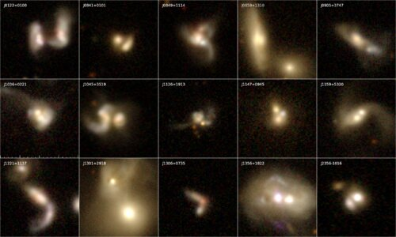
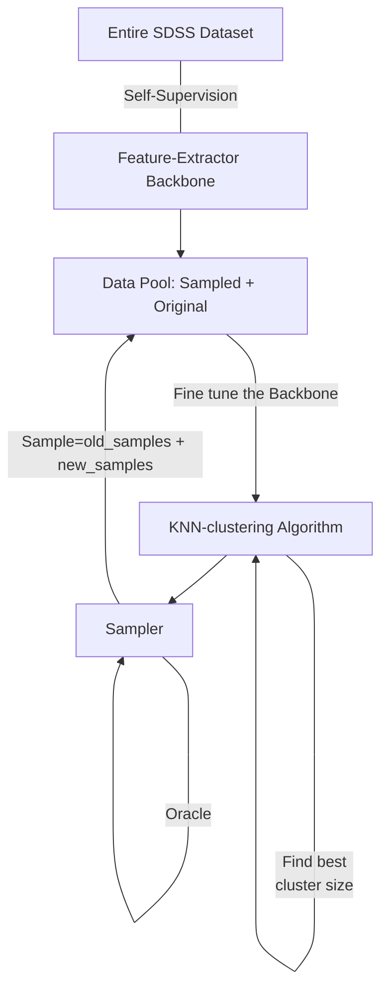

<h1 align="center">
Detection of Dual Active Galactic Nuclei using Self-Supervised Active Learning Guided Detection System 
(SSALD)
</h1>

Official Repository for Project460. 
The main purpose of this project
is to explore the use of self-supervised and active learning based algorithms to classify Dual-Active Galactic Nuclei from using a minuscle dataset.
The number of labeled samples are less than 100 for this project. The project has access to a extemely large unlabelled dataset SDSS(208 Million). 

### Pipelines
The number of samples in SDSS Dataset is extremely small. Labelling new samples is extremely difficult in our case due to the fact that DAGNs are rare in nature.
Hence we use the following algorithm to train our model. The below pipeline is a mixture Active Learning and Self-Supervised Learning.

